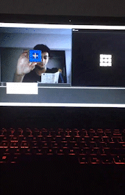

## Real-Time Object Tracking with OpenCV and HSV Thresholding

This repo presents a simple real-time object tracker using `openCV` and HSV thresholding. This software acts as a rudimentary proof-of-concept for an autonomous underwater vehicle's object detection subsystem. 

### OpenCV and HSV Thresholding

The `openCV-object-tracking.py` script uses the `openCV` package track and place a crosshair over a solid colored object. The script tracks the object in real-time by continuously applying the object detection algorithm to every frame from the webcam's video stream. Specifically, the program starts by initializing an HSV threshold -- these HSV limits can be manually entered of generated through the HSV color picker GUI. The threshold is used grayscale and isolate a solid colored object from it's background (HSV thresholding). The leftmost gif below shows a properly thresholed Rubik's cube, where the blue surface of the cube is presented as white while the background is presented as black.  

The script once again uses `openCV` to calculate the centroid of the isolated white object. A crosshair is then placed over the object using its centroid values. A simple series of conditionals are then used to guide the object towards the center of the screen. For example, if the object is located to the top-right corner of the screen, the program will ask the user to move the object towards the bottom-left until the object is properly centered. The final results are shown in the rightmost gif. The object tracking script can be run from the terminal:

```
python3 openCV-object-tracking.py
```

<br />

 


